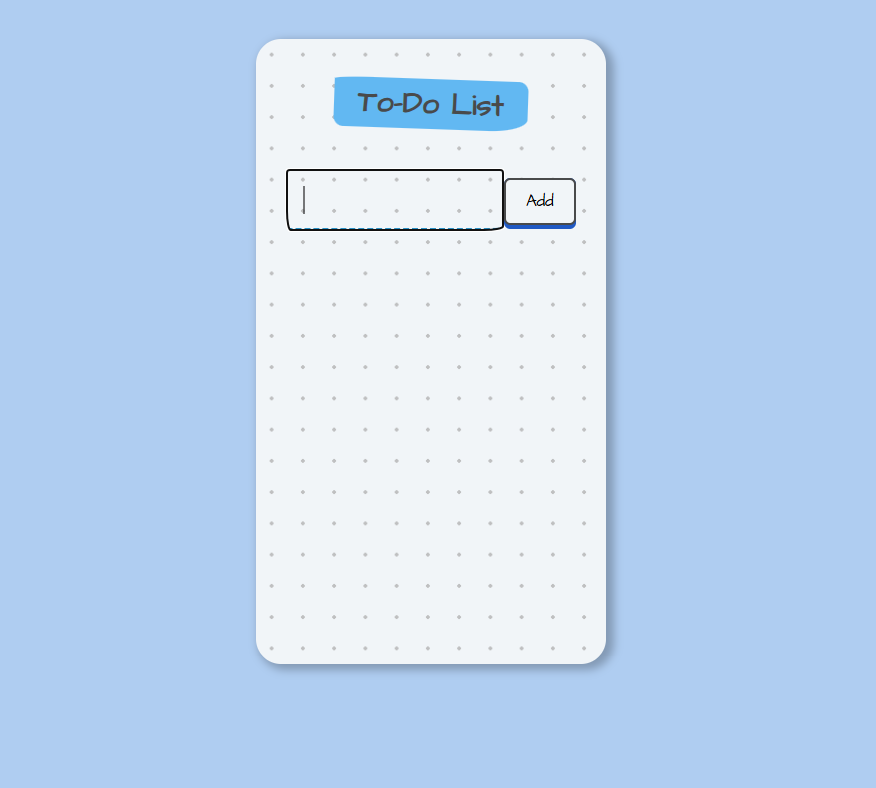
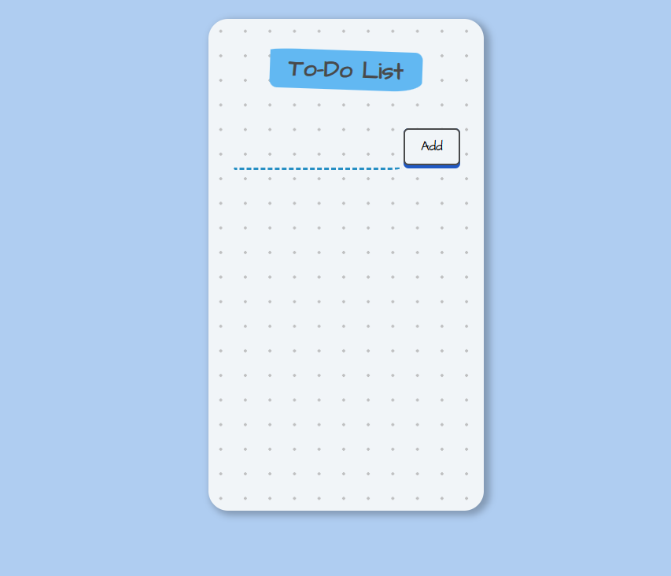
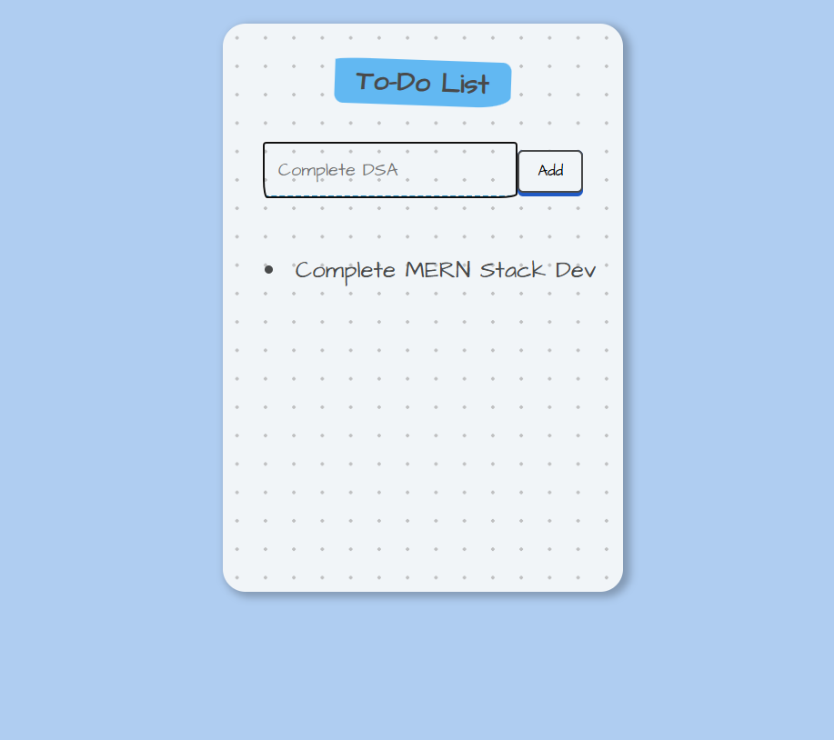
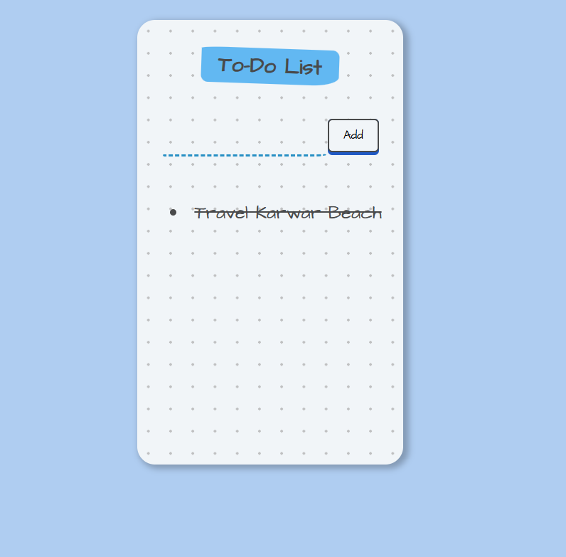
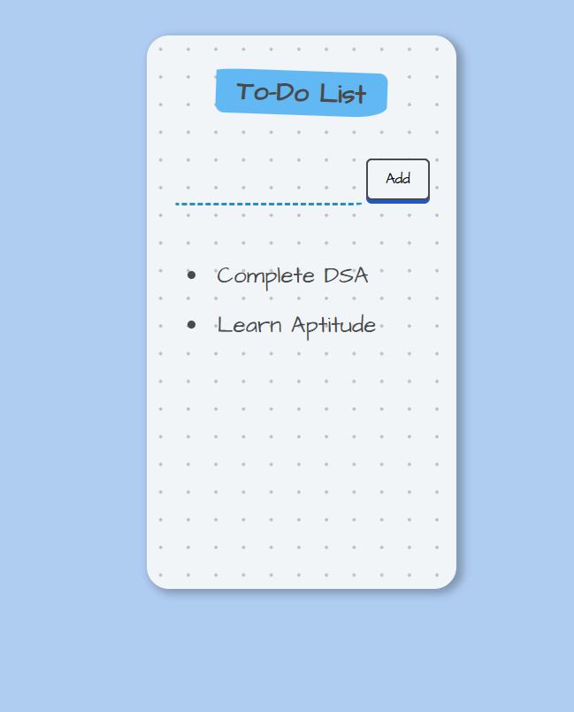

# ✅ ToDoList_using_ReactHook

A clean and simple **React.js application** that demonstrates **To-Do List management** using **React Hooks** for state handling and dynamic updates.  
Built using **React**, **JavaScript (ES6)**, **HTML5**, and **CSS3**.

## Variant 2:  Strike Off when  Completed

This ToDoList using React Hook application allows users to add, view, and manage their daily tasks efficiently.
Each task can be clicked to mark as completed, which automatically applies a strike-through effect (line-through) to visually indicate completion.

## Variant 3: Delete List when  Completed

This ToDoList using React Hook application allows users to add, view, and manage their daily tasks efficiently.
Variant 3 allows users to delete list from the ToDolist, providing full control over task management.

---
## 🖼️ Screenshots  

| 🗒️ ToDoList using React Hook 1 | 🗒️ ToDoList using React Hook 2 |
|------------|------------|
|  |  |

| 🗒️ ToDoList using React Hook 3 | 🗒️ ToDoList using React Hook 4 |
|---------------|---------------|
|  |  |

| 🗒️ ToDoList using React Hook (Variant 2: Strike Off) | 🗒️ ToDoList using React Hook (Variant 3: Delete List)|
|---------------|---------------|
|  |  |

---

## 🛠️ Tech Stack
- ⚛️ **React.js**  
- 💻 **JavaScript (ES6)**  
- 🌐 **HTML5**  
- 🎨 **CSS3**  
- 🚀 **Vite / Create React App**

---
## 🧠 How It Works

1. Add tasks to your to-do list using the input box.  
2. Mark tasks as completed by clicking the checkbox.  
3. Edit or delete tasks instantly.  
4. Data automatically saves in your browser’s local storage.


---

## ⚙️ Features

- 🧩 Add, edit, and delete tasks easily  
- ✅ Mark tasks as completed  
- 💾 Data persistence using **Local Storage**  
- ⚡ Built with **Functional Components** and **React Hooks**  
- 🎨 Clean and minimal UI using **HTML5 & CSS3**

  ---
## ⚛️ React Installation & Application Setup
## 📦 Installation


Install the node modules
```bash
npm install
```

Launch your React project in your browser
```bash
npm run dev
```
 Open [http://localhost:3000](http://localhost:3000)
